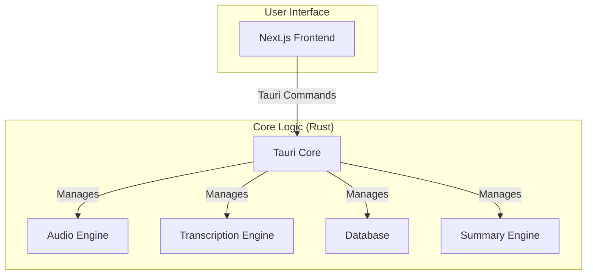

# System Architecture

Meetily is a self-contained desktop application built with [Tauri](https://tauri.app/). It combines a Rust-based backend with a Next.js frontend into a single, efficient, and cross-platform application.

## High-Level Architecture Diagram



## Component Details

### Frontend (Next.js)

*   Provides the user interface for managing meetings, displaying transcriptions, and configuring the application.
*   Communicates with the Rust core through Tauri's command system.

### Backend (Rust Core)

*   **Tauri Core:** The heart of the application, responsible for managing the window, handling events, and exposing the Rust core to the frontend.
*   **Audio Engine:** Captures audio from the microphone and system, processes it, and prepares it for transcription.
*   **Transcription Engine:** Uses local speech-to-text models (Whisper or Parakeet) to transcribe the captured audio. It can be accelerated with a GPU.
*   **Database:** A local SQLite database that stores meeting metadata, transcripts, and summaries.
*   **Summary Engine:** Generates meeting summaries using various Large Language Models (LLMs), including local models via Ollama.

## Audio Device Modularization

**Context**: The audio system was refactored from a monolithic 1028-line `core.rs` file into focused modules. See [AUDIO_MODULARIZATION_PLAN.md](AUDIO_MODULARIZATION_PLAN.md) for details.

```
audio/
├── devices/                    # Device discovery and configuration
│   ├── discovery.rs           # list_audio_devices, trigger_audio_permission
│   ├── microphone.rs          # default_input_device
│   ├── speakers.rs            # default_output_device
│   ├── configuration.rs       # AudioDevice types, parsing
│   └── platform/              # Platform-specific implementations
│       ├── windows.rs         # WASAPI logic (~200 lines)
│       ├── macos.rs           # ScreenCaptureKit logic
│       └── linux.rs           # ALSA/PulseAudio logic
├── capture/                   # Audio stream capture
│   ├── microphone.rs          # Microphone capture stream
│   ├── system.rs              # System audio capture stream
│   └── core_audio.rs          # macOS ScreenCaptureKit integration
├── pipeline.rs                # Audio mixing and VAD processing
├── recording_manager.rs       # High-level recording coordination
├── recording_commands.rs      # Tauri command interface
└── recording_saver.rs         # Audio file writing
```

**When working on audio features**:
- Device detection issues → `devices/discovery.rs` or `devices/platform/{windows,macos,linux}.rs`
- Microphone/speaker problems → `devices/microphone.rs` or `devices/speakers.rs`
- Audio capture issues → `capture/microphone.rs` or `capture/system.rs`
- Mixing/processing problems → `pipeline.rs`
- Recording workflow → `recording_manager.rs`

## Rust to Frontend Communication (Tauri Architecture)

**Command Pattern** (Frontend → Rust):
```typescript
// Frontend: src/app/page.tsx
await invoke('start_recording', {
  mic_device_name: "Built-in Microphone",
  system_device_name: "BlackHole 2ch",
  meeting_name: "Team Standup"
});
```

```rust
// Rust: src/lib.rs
#[tauri::command]
async fn start_recording<R: Runtime>(
    app: AppHandle<R>,
    mic_device_name: Option<String>,
    system_device_name: Option<String>,
    meeting_name: Option<String>
) -> Result<(), String> {
    // Implementation delegates to audio::recording_commands
}
```

**Event Pattern** (Rust → Frontend):
```rust
// Rust: Emit transcript updates
app.emit("transcript-update", TranscriptUpdate {
    text: "Hello world".to_string(),
    timestamp: chrono::Utc::now(),
    // ...
})?;
```

```typescript
// Frontend: Listen for events
await listen<TranscriptUpdate>('transcript-update', (event) => {
  setTranscripts(prev => [...prev, event.payload]);
});
```

## Whisper Model Management

**Model Storage Locations**:
- **Development**: `frontend/models/`
- **Production (macOS)**: `~/Library/Application Support/Meetily/models/`
- **Production (Windows)**: `%APPDATA%\Meetily\models\`

**Model Loading** (frontend/src-tauri/src/whisper_engine/whisper_engine.rs):
```rust
pub async fn load_model(&self, model_name: &str) -> Result<()> {
    // Automatically detects GPU capabilities (Metal/CUDA/Vulkan)
    // Falls back to CPU if GPU unavailable
}
```

**GPU Acceleration**:
- **macOS**: Metal + CoreML (automatically enabled)
- **Windows/Linux**: CUDA (NVIDIA), Vulkan (AMD/Intel), or CPU
- Configure via Cargo features: `--features cuda`, `--features vulkan`

## Key Files Reference

**Core Coordination**:
- [frontend/src-tauri/src/lib.rs](frontend/src-tauri/src/lib.rs) - Main Tauri entry point, command registration
- [frontend/src-tauri/src/audio/mod.rs](frontend/src-tauri/src/audio/mod.rs) - Audio module exports
- [frontend/src-tauri/src/database/mod.rs](frontend/src-tauri/src/database/mod.rs) - Local database module

**Audio System**:
- [frontend/src-tauri/src/audio/recording_manager.rs](frontend/src-tauri/src/audio/recording_manager.rs) - Recording orchestration
- [frontend/src-tauri/src/audio/pipeline.rs](frontend/src-tauri/src/audio/pipeline.rs) - Audio mixing and VAD
- [frontend/src-tauri/src/audio/recording_saver.rs](frontend/src-tauri/src/audio/recording_saver.rs) - Audio file writing

**UI Components**:
- [frontend/src/app/page.tsx](frontend/src/app/page.tsx) - Main recording interface
- [frontend/src/components/Sidebar/SidebarProvider.tsx](frontend/src/components/Sidebar/SidebarProvider.tsx) - Global state management

**Whisper Integration**:
- [frontend/src-tauri/src/whisper_engine/whisper_engine.rs](frontend/src-tauri/src/whisper_engine/whisper_engine.rs) - Whisper model management and transcription
